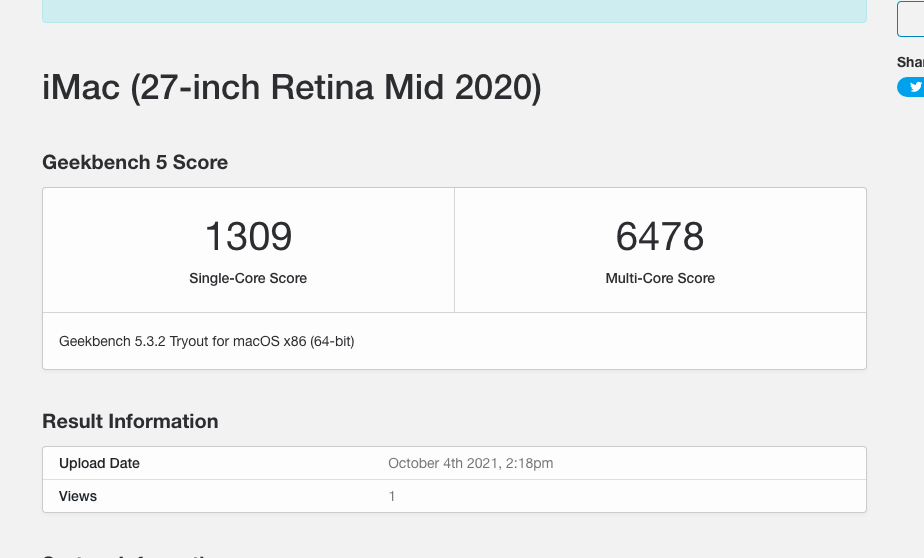

<h3>Hardware:</h3>
<ul>
<li>CPU: Intel Core i5 10600</li>
<li>RAM: HyperX Fury 32GB 2666MHz DDR4 CL16 DIMM (Kit of 2)</li>
<li>Motherboard: Gigabyte B460 Auros Pro AC</li>
<li>GPU: Gigabyte Nvidia GT 730 GDDR5</li>
<li>SSD: Samsung Evo plus 250GB Nvme m.2</li>
<li>Wifi/Bluetooth: Intel® Wi-Fi 9260 / Intel Bluetooth 5.0</li>
<li>Case / PSU: CASE Cooler Master Master MB511-TG-W.
 Power Supply Cooler Master 600W 80+ Elite V4</li>
</ul>

<h3>Bootloader:</h3>
<b>Opencore 0.6.6 — iMac 20,1</b>

<h3>Installation Steps:</h3>
All the required steps are from the official open core guide, please follow it if you need to get the best results, these files only to help you as a simple guide, please use your own if you faced any issues or you have any other hardware.

<h3>Bios Settings</h3>
<b>Disable:</b>
<ul>
    <li>Fast Boot</li>
    <li>CSM</li>
    <li>Thunderbolt(For initial install, as Thunderbolt can cause issues if not setup correctly)</li>
    <li>Intel SGX</li>
    <li>Intel Platform Trust</li>
    <li>CFG Lock</li>
</ul>

<b>Enable:</b>
<ul>
<li>VT-x</li>
<li>Above 4G decoding</li>
<li>Hyper-Threading</li>
<li>Execute Disable Bit</li>
<li>EHCI/XHCI Hand-off</li>
<li>OS type: (Windows 10 Feautres: Ohter)</li>
<li>You can disable iGPU.</li>
</ul>

<b>Needed Drivers:</b>

<li>OpenCanCopy</li>
<li>OpenHfsPlus</li>
<li>OpenRuntime</li>

<b>Kexts:</b>

<li>Airportltlwm</li>
<li>AppleAlc</li>
<li>FakePCIID_Intel_I225-V</li>
<li>FakePCIID</li>
<li>IntelBluetoothFirmware</li>
<li>IntelBluetoothInjector</li>
<li>Lilu</li>
<li>NVMeFix ( If you have NVME only )</li>
<li>RestrictEvents</li>
<li>SMCProcessor</li>
<li>SMCSuperIO</li>
<li>USBPorts</li>
<li>VirtualSMC</li>
<li>WhateverGreen</li>

All of these steps are from the official open core guide, please follow it if you need to get the best results.
 

